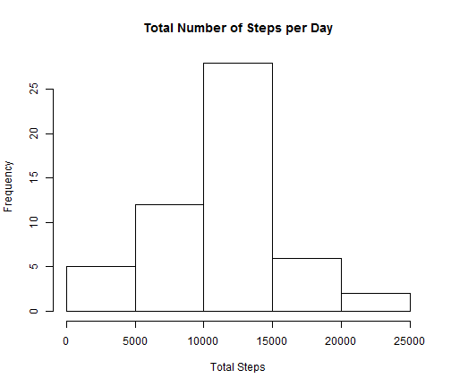
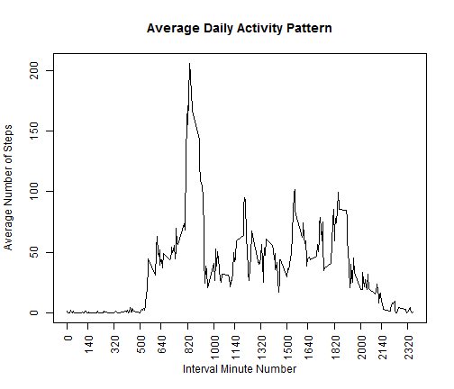
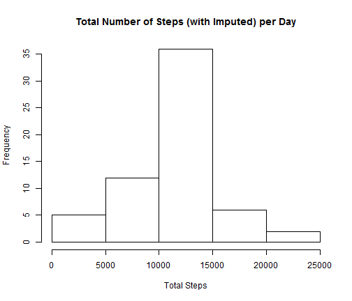
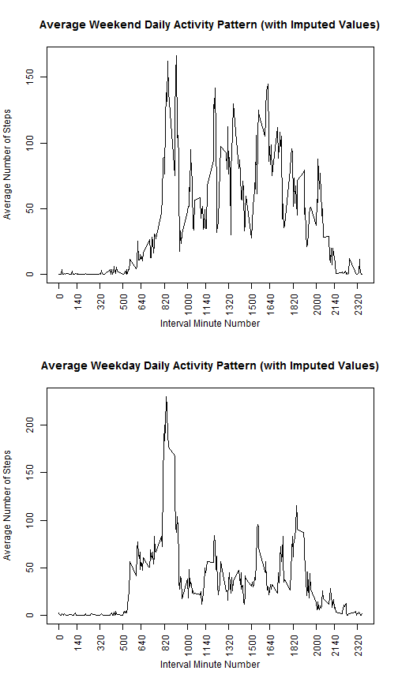

Reproducible Research Assignment 1
========================================================

This assignment looks at activty pattern data, in particular steps taken.

## Obtain Data
Begin by obtaining the zip file with the data, if necessary.


```r
zipFname = "activity.zip"
if (!file.exists(zipFname)) {
    fileUrl <- "http://d396qusza40orc.cloudfront.net/repdata%2Fdata%2Factivity.zip"
    download.file(fileUrl, destfile = zipFname)
}
```


If the data file is not there, unzip the zip.

```r
dataFname = "activity.csv"
if (!file.exists(dataFname)) {
    unzip(zipFname)
}
```


Read in the data and remove NAs

```r
df <- read.csv(dataFname, stringsAsFactors = FALSE)
actData <- df[complete.cases(df), ]
```


## Examine the Data (with NAs Removed)

### Mean Total Number of Steps per Day
Calculate the total number of steps per day

```r
totalSteps <- tapply(actData$steps, actData$date, sum)
```


Create a histogram of the steps -- how many times the number of steps occurred

```r
hist(totalSteps, main = "Total Number of Steps per Day", xlab = "Total Steps")
```

 


Output the mean and median

```r
print(paste("Mean total number of steps: ", mean(totalSteps)))
```

```
## [1] "Mean total number of steps:  10766.1886792453"
```

```r
print(paste("Median total number of steps: ", median(totalSteps)))
```

```
## [1] "Median total number of steps:  10765"
```

### Average Daily Activity Pattern -- Averages per Intervals
Determine the average steps per interval and get the minute numbers ("names") of the intervals (0, 5, 10, etc.). The minute numbers will be used for the axis tick marks in the line plot below.

```r
intervalAvg <- tapply(actData$steps, actData$interval, mean)
theIntervals <- unique(actData$interval)
```


Create a line plot of the average values (on y-axis) for each interval. Set up
the x-axis ticks by using the interval minute number "names" (every 20).

```r
xpos <- theIntervals[seq(1, length(theIntervals), by = 20)]
plot(theIntervals, intervalAvg, type = "l", main = "Average Daily Activity Pattern", 
    ylab = "Average Number of Steps", xlab = "Interval Minute Number", xaxt = "n")
axis(1, at = xpos, las = 2)
```

 


Determine which interval has the maximum average number of steps. maxPos is the index in the array, and is not the actual interval "name" (minute number). Use the interval minute number array to get the interval.

```r
maxPos <- which.max(intervalAvg)
print(paste("Interval with maximum average number of steps: ", theIntervals[maxPos]))
```

```
## [1] "Interval with maximum average number of steps:  835"
```

## Imputing Missing Values
Now address the missing values (the NAs).

How many rows have missing values (NA)?
In this data set the only missing values are in the steps column. But, just in case, confirm with the complete.cases function which identifies NAs in any column.

```r
numNArows <- sum(is.na(df$steps))
nrow(df) - sum(complete.cases(df))
```

```
## [1] 2304
```

```r
print(paste("Number of rows with NAs: ", numNArows))
```

```
## [1] "Number of rows with NAs:  2304"
```

### Strategy for Imputing Missing Values
The strategy chosen for imputing missing values is simple: replace the missing value with the average value for that interval. 

The first column of the dataframe that was originally read in, df, is the step column and has the NAs. The third column indicates the interval. Use the 3rd column to get the interval minute number, figure out which position that is in the vector with the average values and return that average for that interval minute number.

Create new dataset with imputed values.

```r
for (i in 1:nrow(df)) {
    if (is.na(df[i, 1])) {
        df[i, 1] <- intervalAvg[which(theIntervals == df[i, 3])]
    }
}
```

### Look at How Imputed Values Differ from Original 
See how the imputed dataframe values differ from those when the NAs are removed.

Compute the total steps per day as before. Also, just to see that they are different, sum up both the original and the imputed totals.


```r
totalStepsDF <- tapply(df$steps, df$date, sum)

print(paste("Total original steps for all days: ", sum(totalSteps)))
```

```
## [1] "Total original steps for all days:  570608"
```

```r
print(paste("Total imputed steps for all days:", sum(totalStepsDF)))
```

```
## [1] "Total imputed steps for all days: 656737.509433962"
```


Create a historgram of the imputed step totals.

```r
hist(totalStepsDF, main = "Total Number of Steps (with Imputed) per Day", xlab = "Total Steps")
```

 

### Impact of Using Imputed Values
With the imputed values, the range of values (x-axis) doesn't change, but there are now more occurrences of the values. The y-axis now goes up to 35 occurrences for the central bin for 10,000 to 15,000 steps. Previously, the y-axis was closer to 30 occurrences.

Output the imputed mean and median.

```r
print(paste("Mean of total number of steps: ", mean(totalStepsDF)))
```

```
## [1] "Mean of total number of steps:  10766.1886792453"
```

```r
print(paste("Median of total number of steps: ", median(totalStepsDF)))
```

```
## [1] "Median of total number of steps:  10766.1886792453"
```

### Differences Between Imputed and Non-Imputed Values
As mentioned above, the imputed values data has more occurrences of some of the counts, due to the new values added in place of the missing data.

But there are no differences between the imputed mean and median and the original mean and median. This is because the missing values were replaced with the original data's average values. The situation is similar to the following: 

If there are 3 values, 2, 5, and 6, the total is 13 and the average is 13/3 = 4.3333333. 

Use the average to impute a missing value, so now there are 4 values: 2, 5, 6, 4.333333. The total is 17.3333333 and the average is 17.3333333/4 = 4.3333333. So the original average is obtained.

## Activity Differences between Weekend and Weekday
See if there are differences in the activity patterns between weekdays and weekends (using the imputed values dataframe). 

Convert the string date to Date, use the weekdays function to get the day of the week. Then create a logical vector for whether the day is a Saturday or Sunday (true), that is, a weekend or a weekday.

```r
df$date <- as.Date(df$date)
wdays <- weekdays(df$date)
df$isWeekend <- wdays == "Saturday" | wdays == "Sunday"
```


Get ready to make the plots. Determine the average number of steps for weekend day intervals and for weekday day intervals.

```r
weekendDF <- df[df$isWeekend, ]
intAvgWE <- tapply(weekendDF$steps, weekendDF$interval, mean)
weekdayDF <- df[!df$isWeekend, ]
intAvgWD <- tapply(weekdayDF$steps, weekdayDF$interval, mean)
```


Create the panel plot. Put the weekEND data on the top.

```r
par(mfrow = c(2, 1))

plot(theIntervals, intAvgWE, type = "l", main = "Average Weekend Daily Activity Pattern (with Imputed Values)", 
    ylab = "Average Number of Steps", xlab = "Interval Minute Number", xaxt = "n")
axis(1, at = xpos, las = 2)

plot(theIntervals, intAvgWD, type = "l", main = "Average Weekday Daily Activity Pattern (with Imputed Values)", 
    ylab = "Average Number of Steps", xlab = "Interval Minute Number", xaxt = "n")
axis(1, at = xpos, las = 2)
```

 

### Activity Differences
There are activity differences between weekends and weekdays. The number of steps picks up later in the day on a weekend day than a weekday day, which makes sense because people are more likely to get up early on a week day than on the weekend. In addition, the activity is spread out over more of the day on the weekends. In particular, there is more activity in the afternoon on a weekend day. This also makes sense because many people work in offices and are likely to be sitting at their desks in the afternoon. Also, the peak number of steps is lower on a weekend day than a weekday day. The peak on the weekend is less than 200 steps but over 200 steps for the peak on a week day. But the time of the peak for both is simiarly, around interval 820 (early afternoon).
